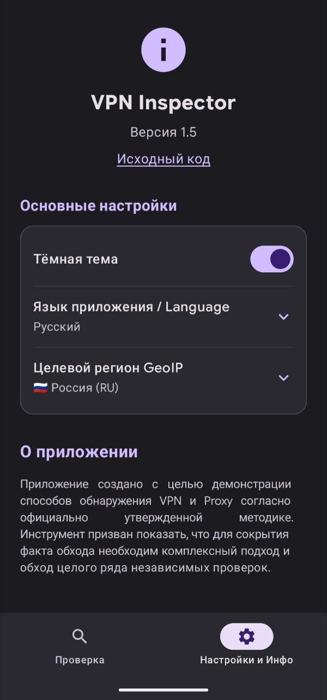

<div align="center">
  
  
  <h1>🛡️ VPN Inspector</h1>
  <p>
    <b>Анализатор обхода блокировок: демонстрация методов обнаружения VPN и Proxy на мобильных устройствах.</b>
  </p>

  <p>
    <a href="README.md">🇬🇧 Read in English</a>
  </p>

  <p>
    <a href="https://android.com"></a>
    <a href="https://kotlinlang.org"></a>
    
    
  </p>
</div>

---

## 📸 Скриншоты

Примеры работы приложения представлены ниже.

### Русскоязычный интерфейс
<div align="center">
  
  &nbsp;&nbsp;&nbsp;&nbsp;
  
</div>

---

## 📖 О проекте

**VPN Inspector** — это специализированное демонстрационное приложение для Android, предназначенное для наглядного анализа механизмов обнаружения VPN-туннелей и Proxy-серверов. Оно реализует современные проверки, основанные на официально утвержденной методике выявления средств обхода ограничений.

Главная цель приложения — продемонстрировать, как именно различные сервисы могут определять факт использования промежуточных узлов, и доказать, что для надежной маскировки трафика необходим комплексный всесторонний подход.

## 🎯 Для кого этот проект?

* 👨‍💻 **Разработчики и специалисты по кибербезопасности**, интересующиеся сетевой изоляцией, защитой трафика и мобильной безопасностью.
* 🔐 **Обычные пользователи**, желающие оценить надежность и целостность своего текущего VPN-соединения или Proxy.
* 🎓 **Студенты и IT-энтузиасты**, изучающие низкоуровневую работу сетевого стека в операционной системе Android.

## 🔬 Проводимые проверки

В приложении развернут многоуровневый комплексный комплект тестов из 11 независимых шагов:

1. **Анализ IP и GeoIP (со стороны сервера)**: Сопоставление публичного IP с сигнатурными базами (выявление хостинг-провайдеров, дата-центров, распределительных CDN сетей и несовпадения целевого региона).
2. **Детектор утечки реального IPv6 (IPv6 Leak)**: Активный опрос выделенного IPv6-only узла для сопоставления страны IPv6 со страной IPv4 (выявление утечки IPv6 в обход туннеля VPN).
3. **ConnectivityManager VPN Flag**: Прямой опрос системных сетевых возможностей устройства на наличие активного VPN-адаптера (`TRANSPORT_VPN`).
4. **Проверка системного прокси**: Опрос JVM-свойств (таких как `System.getProperty("http.proxyHost")`) на предмет принудительного использования прокси-сервера.
5. **Поиск известных VPN-пакетов**: Проверка перечня установленных приложений на наличие программ обхода блокировок (например, ByeDPI, AmneziaVPN, WireGuard, ShadowSocks, Tor).
6. **Оценка Capabilities NOT_VPN**: Контроль присутствия или отсутствия обязательного системного разрешения `NET_CAPABILITY_NOT_VPN` у активной сети.
7. **Анализ сетевых интерфейсов Linux**: Поиск виртуальных сетевых адаптеров, поднятых туннельными протоколами (например, `tun0`, `tap0`, `wg0`, `ppp0`).
8. **Обнаружение аномалий MTU**: Считывание размера максимального полезного блока передачи данных. Заниженный MTU указывает на накладные расходы инкапсуляции.
9. **Сканирование локальных Proxy-портов**: Локальный опрос сокетов на часто используемых портах для выявления локальных перехватчиков трафика.
10. **Проверка подмены адресов (Fake-IP)**: Попытка резолва известных адресов на серверах для определения выдачи виртуальных подсетей.
11. **Анализ задержек SNITCH**: Сравнение физического времени отклика (RTT) до серверов в разных частях мира для оценки неестественного удлинения маршрута.

> **📚 Методичка в комплекте:** В приложение встроен полный, переведенный интерактивный материал на основе официальных методических рекомендаций для детального ознакомления с физикой каждого процесса.

## 🛠 Технологический стек

* **Язык разработки:** Kotlin
* **Интерфейс:** Jetpack Compose, Material Design 3 (Полная поддержка светлой и тёмной тем)
* **Сеть/Парсинг:** Retrofit 2, Moshi с защитой от сбоев
* **Асинхронность:** Kotlin Coroutines & Flow
* **Конфигурация:** SharedPreferences для сохранения настроек и выбранных пользователем вкладок

---

## 🚀 Сборка проекта

Вы можете скомпилировать проект локально через Gradle или открыть его в Android Studio:

```bash
# 1. Клонируйте репозиторий
git clone https://github.com/Kasumicic/vpn-inspector.git
cd vpn-inspector

# 2. Запустите сборку отладочного APK
gradle assembleDebug
```
Готовый пакет APK для установки будет находиться по пути `app/build/outputs/apk/debug/app-debug.apk`.

---

<div align="center">
  
  <br>
  Разработано с ❤️ <b><a href="https://github.com/Kasumicic">Kasumicic</a></b>
</div>
